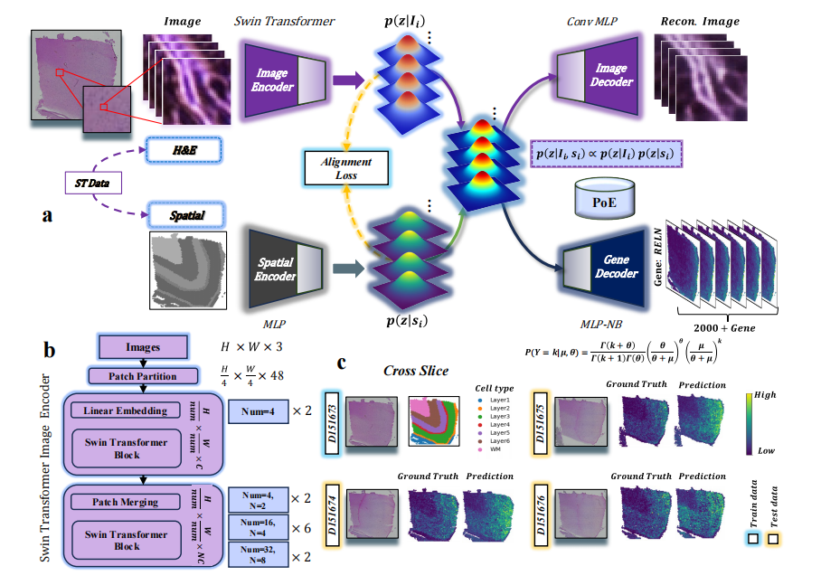

# STevs.v1.0
# STevs: Cross-Slice Spatial Transcriptomics Gene Expression Prediction

STevs is a deep generative model designed to predict spatial gene expression from histology images. The core strength of this model lies in its powerful cross-slice generalization ability, enabling it to learn slice-invariant universal representations, which is particularly suitable for predicting gene expression in **3D continuous tissue sections**.

*Figure: The overall framework of the STevs model.*

## How to Run

Please follow these three steps to reproduce our work:

### 1\. Get the Data

The datasets used in this study are all publicly available. Please refer to the **4.1 DATASETS** section in our paper to find the original publications and download the corresponding datasets. The main datasets include:

  * **Human Dorsolateral Prefrontal Cortex (DLPFC):** [Nature Neuroscience](https://doi.org/10.1038/s41593-020-00787-0)
  * **10x Visium Mouse Brain:** [Science](https://www.science.org/doi/abs/10.1126/science.aaf2403)
  * **Human Breast Cancer (HBC):** [Nature Genetics](https://doi.org/10.1038/s41588-021-00911-1)
  * **Human Squamous Cell Carcinoma (HSC):** [Cell](https://doi.org/10.1016/j.cell.2020.05.039)
  * **MISAR-seq:** [Nature Methods](https://doi.org/10.1038/s41592-023-01884-1)

### 2\. Preprocess the Data

Before running the model, the downloaded data needs to be preprocessed. Please refer to the code examples in the `preprocess/run_preprocess_for_data.ipynb` file, which will guide you through all the preprocessing steps.

### 3\. Run the Code

Once the data is ready, you can directly run the `run.ipynb` file in the project's root directory to train and evaluate the STevs model. This file contains the workflow for model training, evaluation, and visualization.
